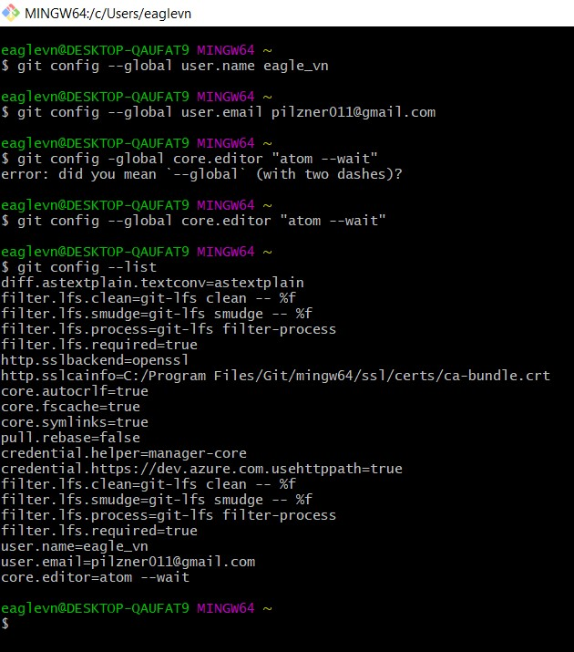
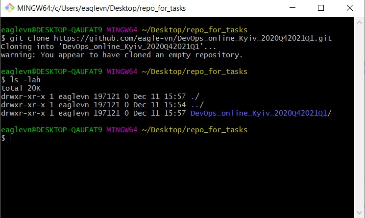
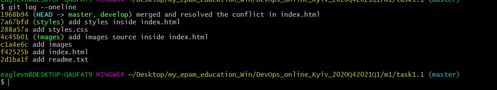
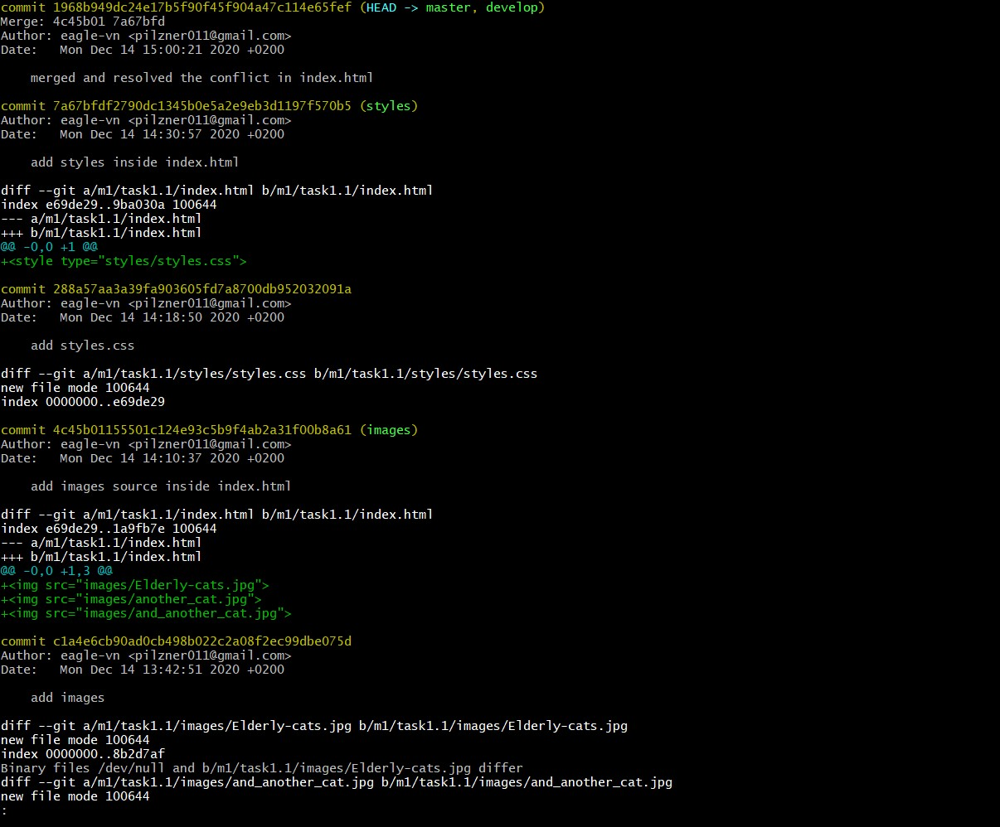
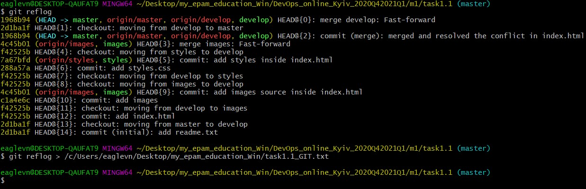

# DevOps Introduction
## TASK 1.1

Installed and configured GIT on my workstation.


Cloned repo.


Then I followed by the instruction step by step.
1. Created empty file readme.txt. Committed. ```git add .; git commit```
2. Created develop branch and checkout on it. ```git checkout -b develop```
3. Created index.html. Committed. ```touch index.html; git add .; git commit -m 'comment'```
4. Created images branch and checkout on it. Added images folder with cats.
Committed. ```git checkout -b images```
5. etc


Did all stuff until merging "images" and "styles" into "develop"
While trying to merge "styles" into "develop" conflict occurred.
Make sure that index.html from one branch doesn't conflict with another.
We can delete "separators" manually. Then commits. Conflict was resolved.

Used ```git log --oneline``` <br/>


For more detailed log we can use ```git log -p``` <br/>



Pushed all changes ```git push origin --all```

Save content from ```git reflog``` out of repo. <br/>
```git reflog > /c/Users/eaglevn/Desktop/my_epam_education_Win/task1.1_GIT.txt```<br/>


Added task1.1_GIT.txt to my repo. Pushed it.

*DevOps is a set of methodologies that help to synchronize and coordinate workflow across all areas of development. From planning to release.*
