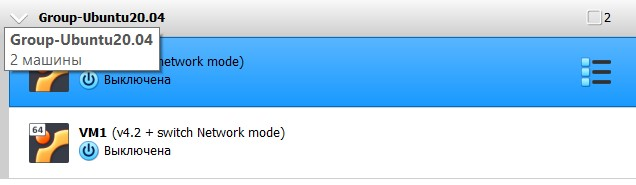
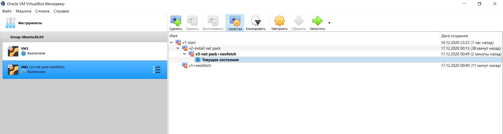
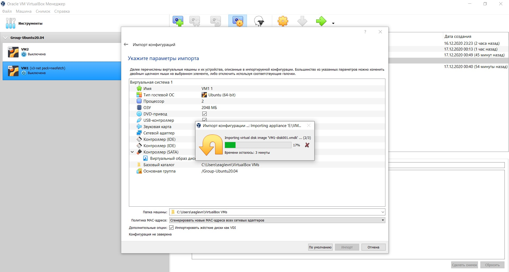
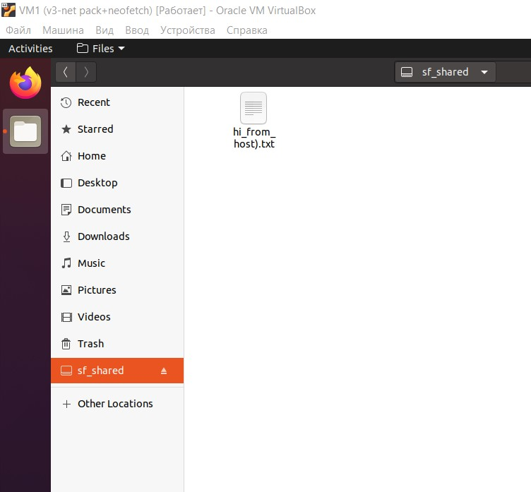
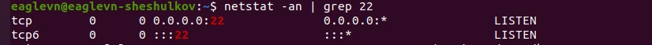
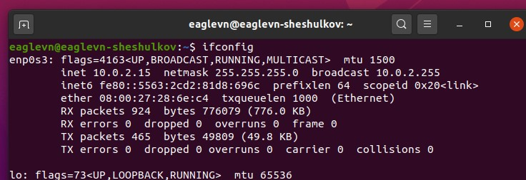
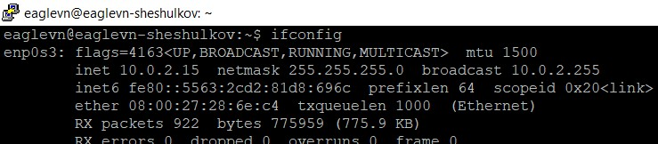

# Virtualization and Cloud Basic
## TASK 2.1
### Part 1. Hypervisors
1. The most popular hypervisors for infrastructure virtualization are Microsoft Hyper-V,
VMware ESX Server, Citrix Xen Server. Which are hypervisors 1th type.

2. The main difference between for example VMware and VirtualBox is that VMBox is free but there are no
support. As opposite, WMvare provides technical support but for using their products we have to pay.

### Part 2.1. Work with VirtualBox

1. Got acquainted with the structure of the user manual https://www.virtualbox.org/manual/

**Some copypastes for understanding basics**

Terminology:
 - Host operating system (host OS). This is the OS of the physical computer
on which Oracle VM VirtualBox was installed.

 - Guest operating system (guest OS). This is the OS that is running inside the virtual machine.

 - Virtual machine (VM). This is the special environment that Oracle VM VirtualBox creates for your
guest OS while it is running. In other words, you run your guest OS in a VM.

 - Guest Additions. This refers to special software packages which are shipped with Oracle VM VirtualBox
but designed to be installed inside a VM to improve performance of the guest OS and to add extra features.

2. Скачал последнюю версию VBox на свою хостовую ОС. Ресурс для скачинваия https://www.virtualbox.org/

3. Create VM1 and install Ubuntu 20.04. **Looking ahead, it was a mistake. Next time I will experiment with Ubuntu 16.04**

*Here are some details that I wanted to write down to made my experience with the basic things more memorable. The reason is that many things that I met here were new to me.*

 - AT first, I've made Virtual machine (selected type and version) - Linux; Ubuntu (64-bit) Specified the amount of RAM.

 - While creating a virtual hard disk, I chose the VDI type for the reason that it was developed precisely for this soft. So I assume it works better.

 - I specified dynamic virtual hard disk (less than 30 Gb). At this point that's all with creating of virtual computer.

 - Next, I downloaded ISO virtual image of Ubuntu 20.04 distribution. And again this one is mistake. I woulde choose Ubuntu 16.04 LTS next time.

 - Then, openned settings of the virtual machin > Carrier > Controlles: IDE(DVD driver).

 - I chose the image of optical disk, entered the folder with .iso file, selected the file and pressed OK.

 - Eventually I was able to run the virtual machine! > Start

 - At that point the OS was starting from the .iso image. I picked needed options (set login, password and computer name (eaglevn-sheshulkov)

 - After finishing the process of copying files from an image to a virtual hard disk in the virtual machine, I turned the virtual machine on.
Then I opened general settings, turned on the general clipboard - bi-directional. I opened System preferences and added one vCore (now 2 CPUs).

4. Got acquainted with the basic possibilities. Like start, reboot, save state and etc.
Also I decided to study hotkeys. Which ones are there and what for?
 - The "host" key by default is Right Ctrl.
 - Show context menu in full screen mode - host + home.
 - ACPI power button - shutdown guest OS - host + H
 - open the VM settings dialog - host + S
 - Reboot - host + R
 - full screen - host + F
 - scaling mode - host + C
 - take a snapshot of the state - host + T
 - mount ISO containing guest additions - Host key + D


5. Cloned an existing VM1 by creating a VM2.</br>
Choose: Generate New MAC Addresses For All Network Adapters value assigns a new MAC address to each network card during cloning.
To further create a network between guest operating systems.</br>
I decided to check the MAC address of virtual machines using the command  ```sudo dmesg | grep eth0```

6. Created a group of two VMs. (see 2.1.1)


Groups allow us to simultaneously start and shut down Virtual Machines.
Monitor snapshots and general metrics of virtual machines.

7. I made branching snapshots, installing applications and rolling back to the states of the Virtual Machine I needed.


8. Exported VM1 to my hard drive in .ova format</br>
Imported the VM from the .ova file back.


### Part 2.2. Configuration of virtual machines

1. Made some research with VM config.

2. Configured USB port for VMs.

During the configuration of USB adapters available for the guest OS, I learned that each manufacturer of USB adapters has its own
unique hexadecimal code. Also, each of their products has their own unique hexadecimal code.

When USB devices are connected to the Guest OS, they become unavailable on the Host OS.

3. I installed additional extensions for shared folders to work.
Devices> Mount Guest OS Addon Image. > go to file manager> VBOXAddition > Run Software.
After VM was rebooted I disabled the image.

*For Windows guests, shared folders are implemented as a pseudo network redirector.
For Linux and Oracle Solaris guests, Guest Additions provide a virtual file system.*

I created a shared folder from the Guest OS, rebooted the system, a folder appeared. But since the user with the guest OS is not located by default
in a group that is allowed to read this folder, it will not open. So I add the user to the vboxsf group.
(see 2.1.3.1)



4. So, Networks. Let's start.

Each network adapter can be configured to operate in one of the following modes:
- ***Not attached***. Not included. In this mode Oracle VM VirtualBox informs the guest,
that the network card exists, but there is no connection. It's as if the network card was not
Ethernet cable connected. In this mode, you can pull out the virtual Ethernet cable
and terminate the connection, which can be useful to inform the guest operating room
system that the network connection is unavailable, and for forced reconfiguration.

- ***Network Address Translation (NAT)*** (The virtual machine uses the host as a proxy.)
VBox creates something like an internal network for each client.
 When we ping from VM1 www.google.com we get answers
But when I tried to ping my virtual machine, from the host machine. The virtual machine did not respond.
But VBox offers a way to gain access to the VM through the host or even from an external Internet. It calls Port Forwading
Let's try to set up the rules by which we can connect to our VM via SSH.
Leave the default TCP protocol. We indicate the host port (it should not coincide with other services), select the random 2277.
Leave the Host Address field blank. So that we can connect from any IP. Guest port - 22 (TCP / UDP protocol port - SSH)</br>
Make sure the SSH service on VM is running.</br>
```
systemctl status sshd
> Unit sshd.service could not be found.
sudo apt-get install openssh-server
systemctl status sshd - make sure ssh is available
netstat -an | grep 22
```
(see 2.1.4)

Open PuTTY. Select SSH, enter the port that we forwarded 2277
Enter Host IP.
(see 2.1.5 and 2.1.6)


- ***NAT Network*** allows us to create an internal network for virtual machines to communicate with each other. All virtual machines
on one NAT Networks will be able to communicate with each other. But the way they will communicate with the external internet is the same
as in Network Address translation. (NAT)</br> *File> Prefer> Network> Add a new NAT network.
Next, go to the virtual machine > settings and change the mod to NAT Network, select the NAT network that we just created.
Trying to ping Virtual Machines within the NAT network. There is an answer.*

- ***Bridged networking***. Bridge networks. This is for more complex network tasks like network simulation
and running servers in guest mode. If enabled, Oracle VM VirtualBox connects to one of
installed network cards and directly exchanges network packets, bypassing the network stack of our operating system.
</br>In this case, Virtual Box uses the net filter driver on the host OS to intercept data packets directly from the physical network port.
This creates a new virtual network interface along with the host network interface.
</br>This allows Virtual Machines to communicate directly with the host. It also allows me to take part in routing and connecting to my network.
The machines were assigned the IP of my home network. Machines can communicate with each other.
</br>The host can also ping the guest operating systems, but the guest operating systems do not receive a response from the host.
However, this is because the ICMP port was closed. On Win10 they are closed by default.
After opening the port, the host also started pinging from the guest OS.

- ***Internal networking***. Internal network. This can be used to create another type of programming network,
visible to the selected virtual machines, but not to applications running on the host or to the outside world.
You can set up a network for VM to communicate with VM. This is safer than bridging.
Guest OS can only communicate with each other. They cannot access an external Internet, just as an external Internet cannot access them.

- ***Host-only networking***. Host-only network. This can be used to create a network containing a host and
a set of virtual machines, without a physical host network interface. Instead, a virtual
a network interface, similar to the loopback interface, that allows communication between virtual machines and a host.
</br>*The "Host-only networking" option means that the virtual computer can communicate with the operating system
the host computer and any virtual computer running on the host computer that also has networking capabilities.
This mod is very similar to the International Network, except that the same host can be included in this network. But there is no access to the external Internet.
In this case, VBox virtualizes a separate network adapter for the host, for the connection to the host-onl network.
We can change it or add a new one by going to> File> Host Network Manager.
We can configure the adapter manually. Having configured it for a different network, there is also a DHCP server configuration option.
The machines ping each other. From the Host they also respond. Guests can also ping, but only through the virtual interface that was created
VBox for this network.*

Mode       |VM>Host|VM<Host|VM1<>VM2|VM>Net/Lan|VM<Net/Lan|
-----------|:-----:|:-----:|:------:|:--------:|:--------:|
Host-only  | +     |+      |+       |-         |-         |
Internal   | -     |-      |+       |-         |-         |
Bridged    |+      |+      |+       |+         |+         |
NAT        |+      |Port F |-       |+         |Port F    |
NAT Network|+      |Port F |+       |+         |Port F    |


*Notes:*

About jumbo frames - these are network packets with more than 1500 bytes of data.
Jumbo frames provided that you use the Intel card virtualization and bridged networking.
Jumbo frames are not supported with the AMD networking devices.
In those cases, jumbo packets will silently be dropped for both the transmit and the receive direction.

In Network Bridge mode, all packets are sent and received through the physical network adapter on the host machine.

### Part 2.3. Work with CLI through VBoxManage
