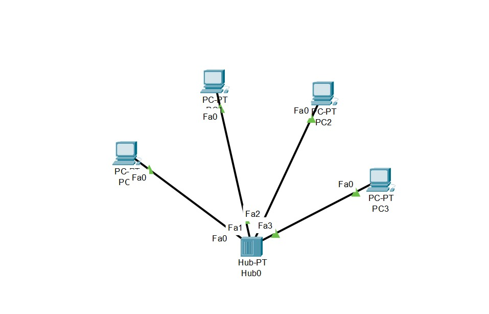
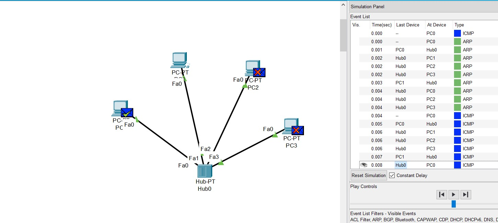
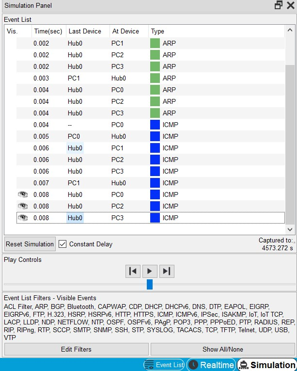
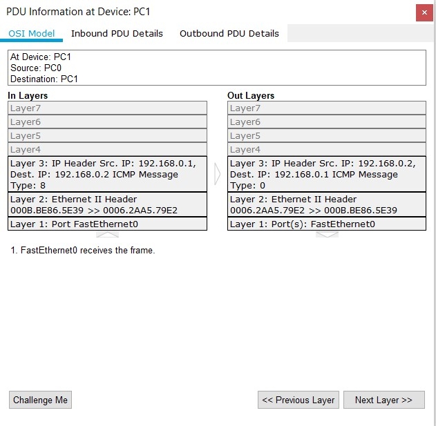
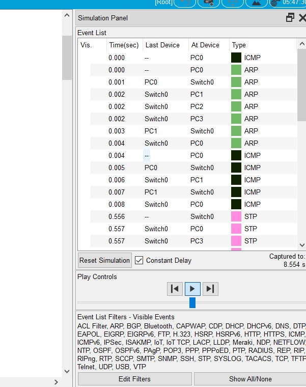
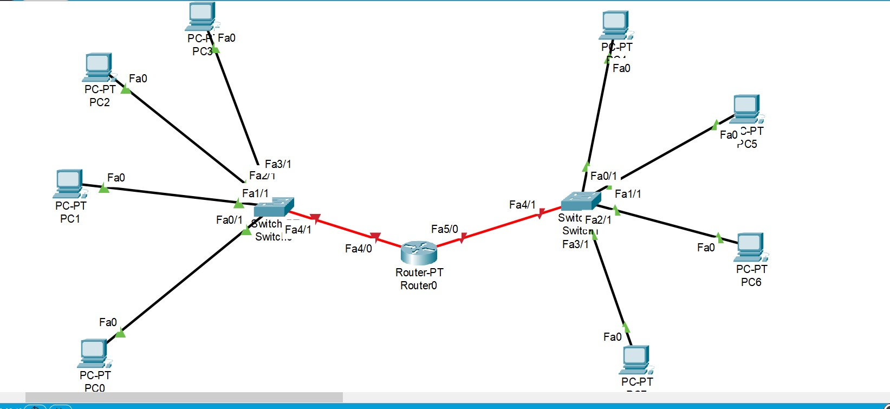
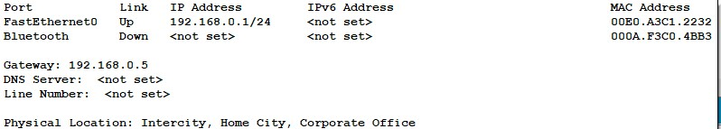
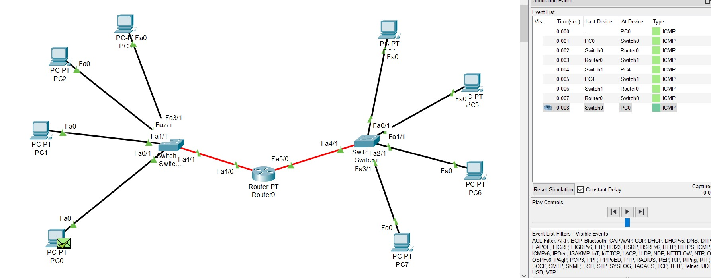

# Networking Fundamentals
## TASK 4.1

1. Created the requested topology. 4 PCs are connected to the Hub.
2. 4.1.2


3. Assigned a unique IP address for each PC with a subnet mask 255.255.255.0


PC  |IP
----|------------
PC0 | 192.168.0.1
PC1 | 192.168.0.2
PC2 | 192.168.0.3
PC3 | 192.168.0.4


4. Checked the network. The network works well
5. Sending ICMP packets from PC0 to PC1 (see 4.1.5)


6. Tracked the simulation of ICMP packets (see 4.1.6)


7. OSI model compliance (see 4.1.7)


Learned how to see MAC addresses in arp-table ```arp -a```
and how to clear it ```arp -d```


8. Deleted previously assigned static IPs.

9. Added a server, 2 PCs and 1 more hub. Reassigned IP according to the table.

I am trying to send an ICMP packet on the same route. Packages are now sent the same way to the new hub,
which sends these packets further down the network. But they are dropped because IP address does not match with destination that
specified. When trying to send packets to a PC or server that is not in the source's MAC address table,
an ARP packet is created to find out the MAC address for the specified IP.

10. For topology 2, the IP Address table is as follows:


PC/Server | IP
----------|-----------
PC0       |192.168.0.1
PC1       |192.168.0.2
PC2       |192.168.0.3
PC3       |192.168.0.4
PC4       |192.168.0.6
PC5       |192.168.0.7
Server    |192.168.0.5

11. The network works stably. Each network component can ping each other.


12. Created a similar topology. Using Copper Straight-through (twisted pair) I connected all devices (4 PCs and a switch).

13. Assigned an IP address to each PC. Started checking the network by sending ICMP packets from PC0 to PC1. (see 4.1.13)



14. Expanded the project as requested in the task.

15. Added one port for each switch.

16. Assigned a static IP to each PC.

17. Sent an ICMP packet from PC0 to PC4. Everything works well.

18. Added Router-PT. Removed Copper Cross-over, which was between switches. Connected the Router to the switches using fiber (see 4.1.18)



19. Changed IP of PC4-PC7.

20. Set the router ports to No Shut. Assigned each port an IP Address.

21. Assigned a default gateway for each PC, according to each subnet. (see 4.1.21)



22. Ping from PC0 to PC4. There is an answer. The network works well. (see 4.1.22)



23. Networking in topology 4 and topology 5 works quite similarly. However, with the addition of a router, we were able to subdivide the network into subnets.

24. Routers give us the ability to create subnets. Also communicate with other subnets.
