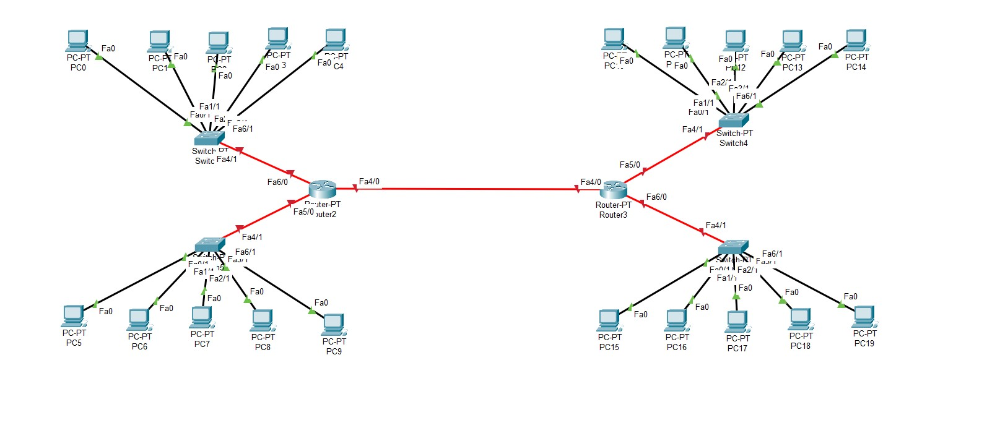
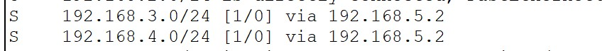
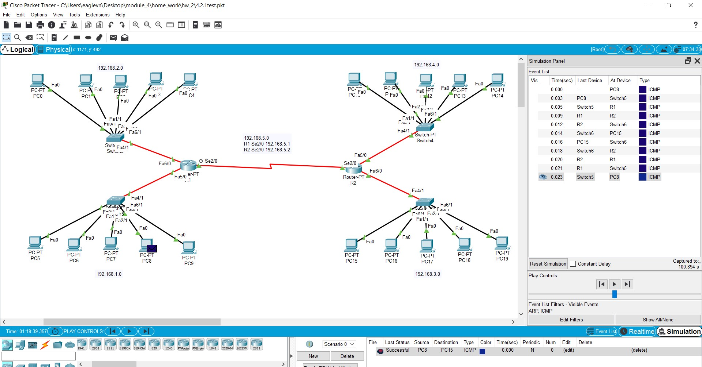

# Networking Fundamentals
## TASK 4.2.1

For communication between the two buildings, I used a serial DCE cable that connects the two routers.
I decided that there will be a switch for each floor. On each floor, I connected a switch to the router using fiber.
Then I connected every PC to a switch on every floor. (see 4.2.1.1)

Each floor in each building was assigned its own subnet.

After a static IP has been issued to each PC, as well as a default gateway is assigned, which is the IP of the interface of
the router that has been allocated for this subnet.

Added clock rate 64000 to the serial interface for the R1 router, which is now DCE and sets the clock rate on its own
for router R2. Therefore, I do not need to set the clock rate on the R2 router.

Started checking the network. PC5 (192.168.1.2) could ping PC0 (192.168.2.2). But when trying to ping from PC5 (192.168.1.2) to PC15 (192.168.3.2)
packets were coming back to the router, PC15 was unreachable.

Router 1 doesn't know about Router 2. So we have to build routes.

For router R1, configure Route for networks 192.168.4.0 and 192.168.3.0 through interface 2/0 on router R2 192.168.5.2
The same was done for R2. Route for 192.168.1.0 and 192.168.2.0 networks through the 2/0 interface on the R1 192.168.5.1 router (see 4.2.1.2)

Trying to ping the PC from left build to right build.
We see the answers. Packets are sent correctly. The network works well. (see 4.2.1.3)

