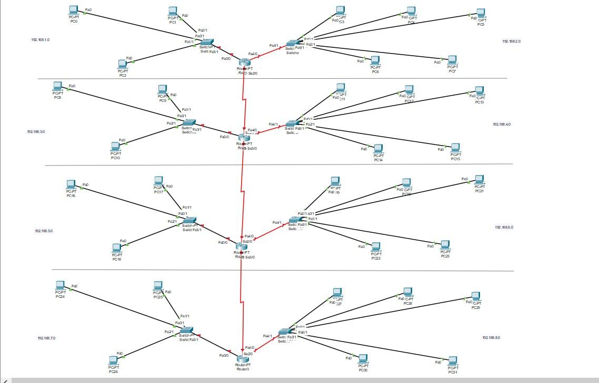
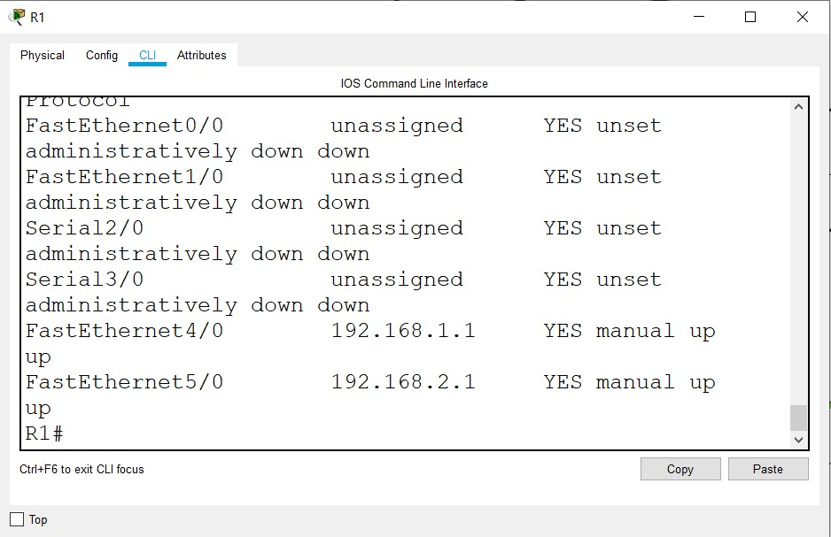
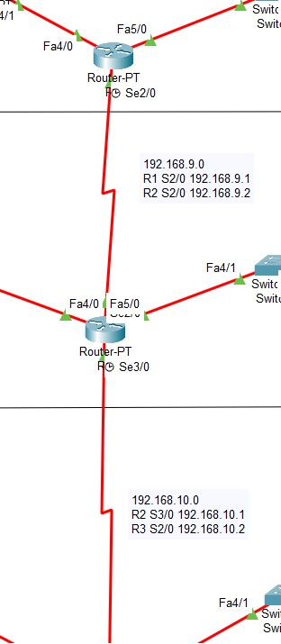
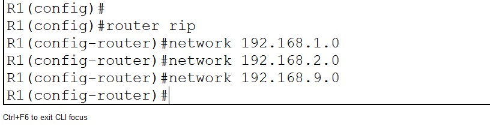
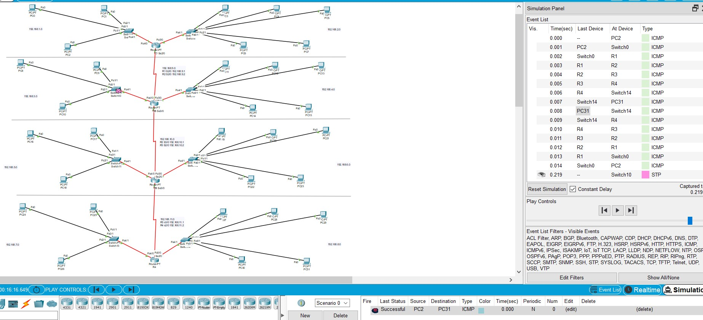
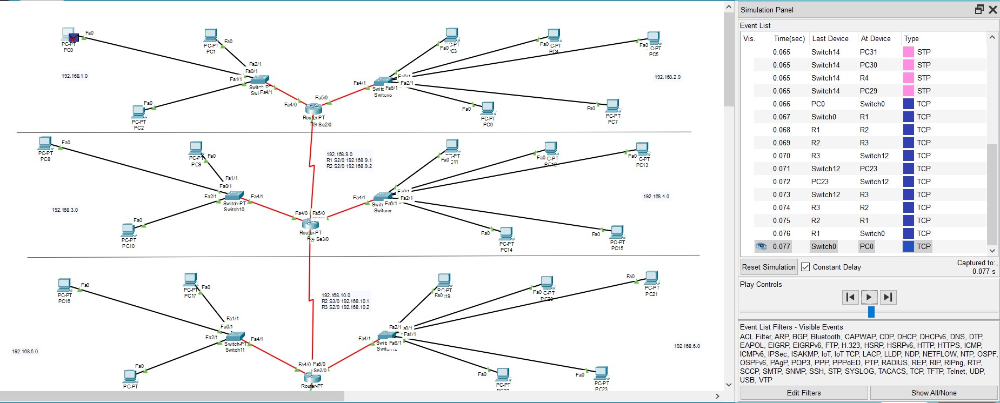

# Networking Fundamentals
## TASK 4.2.1

For communication between the two buildings, I used a serial DCE cable that connects the two routers.
I decided that there will be a switch for each floor. On each floor, I connected a switch to the router using fiber.
Then I connected every PC to a switch on every floor. (see 4.2.1.1)

Each floor in each building was assigned its own subnet.

After a static IP has been issued to each PC, as well as a default gateway is assigned, which is the IP of the interface of
the router that has been allocated for this subnet.

Added clock rate 64000 to the serial interface for the R1 router, which is now DCE and sets the clock rate on its own
for router R2. Therefore, I do not need to set the clock rate on the R2 router.

Started checking the network. PC5 (192.168.1.2) could ping PC0 (192.168.2.2). But when trying to ping from PC5 (192.168.1.2) to PC15 (192.168.3.2)
packets were coming back to the router, PC15 was unreachable.

Router 1 doesn't know about Router 2. So we have to build routes.

For router R1, configure Route for networks 192.168.4.0 and 192.168.3.0 through interface 2/0 on router R2 192.168.5.2
The same was done for R2. Route for 192.168.1.0 and 192.168.2.0 networks through the 2/0 interface on the R1 192.168.5.1 router (see 4.2.1.2)

Trying to ping the PC from left build to right build.
We see the answers. Packets are sent correctly. The network works well. (see 4.2.1.3)

## TASK 4.2.2

Created a topology according to the task.
Four floors each with 2 switches and one router.
Routers are connected to each other via Serial DCE.

Each workgroup has its own subnet and its own switch.
I gave each group an according default gateway. (see 4.2.2.1)

In the R1 router, we configure the f4/0 interface and assign it an address 192.168.1.1/24 then do no shut for this one. For the f5/0 interface, we also do the same things. (see 4.2.2.2)

Then we do this to each router in the topology.

Configured clock rate at 64000

Add subnets between interfaces for
each router. (screen 4.2.2.3)

Because There are many routers and it takes a while to register routes manually for each. I googled the solution,
which will save time. It's about the RIP(Routing Information Protocol).
In global router configurations I went to the rip settings ``router rip`` Next I indicated the networks through which
RIP will build routes automatically. (see 4.2.2.4)

Trying to send ICMP packets from PC2 to PC31. (see 4.2.2.5)
Packets go through without any problems.

Let's form a packet on PC0 sending data to PC23 with 80 remote port.
(see 4.2.2.6) Packages have successfully gone all their way. The network works stably.

## TASK 4.2.3

# To be continued
