# Linux Essentials
## TASK 5.1
### Part 1

1. Installed Ubuntu 16.04 in VirtualBox. Logged in as root.

2. Changed the password for the root user using the command
`passwd root`</br>(see 5.1.1.1)</br>
</br>
This changed the system file /etc/shadow.

3. (see 5.1.1.2)</br>
</br>
As we can see from the screenshot, the system has pseudo-users. An important distinguishing feature is that they do not have an interpreter. And also their id > 1000.
For example, deamon is used for system services. On my system its uid = 1
There is also a root user. This is the user who owns all the files in current system.
By default, its uid = 0.
uid < 1000 is used for regular users.

4. To add or change user information we will use the `usermod` command
The `usermod` command with the "-c" parameter will allow us to add additional information about the user, such as last name first name,
phone number, rating in computer games.
(see 5.1.1.3)</br>


5. By using `man passwd`, I found 2 interesting keys:</br>

  -e "Immediately expire an account's password. This in effect can force a user
to change his/her password at the user's next login."</br>
(see 5.1.1.4 and 5.1.1.5)</br>
</br>
</br>
 -x Set the maximum number of days a password remains valid. After MAX_DAYS, the password is required to be changed.</br>
(see 5.1.1.6)</br>
</br>
Let's do the same research for the usermod command</br>
 -e, --expiredate EXPIRE_DATE
    The date on which the user account will be disabled. The date is
    specified in the format YYYY-MM-DD.</br>
 -l, --login NEW_LOGIN
    The name of the user will be changed from LOGIN to NEW_LOGIN. Nothing
    else is changed. In particular, the user's home directory or mail spool should probably be renamed manually to reflect the new login name.</br>
    ```
    usermod -l zaza_02 zaza_01
    ```
    Changed the login, but did not change the home directory. The directory must be renamed manually. (see 5.1.1.7)
    

6. More and less are very similar commands, but less is more convenient, there I can scroll the text in the opposite direction,
control with enter and space. To exit the viewer press q
to find something, I entered "/*some_text"</br>
Very helpful commands. Looked at .bashrc content using less command
(see 5.1.1.8)


7. I installed finger. Than opened the manual, looked for information that will help me to complete the task.
Than created the .plan file in the user's home directory and wrote my plan there. (see 5.1.1.9)


8. For this task, the -l parameter will suffice
(see 5.1.1.10)</br>
</br>
As we can see  letter "d" indicates that the file is a directory.

### Part 2

1. The `tree` command is able to display the structure of all directories on the system, in the form of a tree.
If we just enter the `tree` in home directory, we will see all the folders, subfolders and files in the form of a tree.
The `tree` has a huge number of options.</br>
First of all, the `-f` option which prefixes the path. Which can be useful for writing all sorts of scripts.
Also, we can add the `-d` option, only folders will be displayed.
We can also set a restriction on showing folders with more files than we want to see.</br>
For example `tree -d --filelimit 22` will display us only directories with no more than 22 files.</br>
By default, `tree` does not list hidden folders. To see them, we can use the `-a` option.</br>
The `-D` option will print files with the date they were last modified.</br>
The `-P` option allows us to search for files with the requested mask. In this case, the file name must be enclosed in quotation marks.</br>
The `--prune` option will exclude from the output all folders that do not contain the file we are looking for.</br>
For example `tree -P '*.py' --prune`
will show us only those directories that have '*.py' files and `--prune` will exclude from the output all folders that have no files
matching the output template. (see 5.1.1.11)</br>
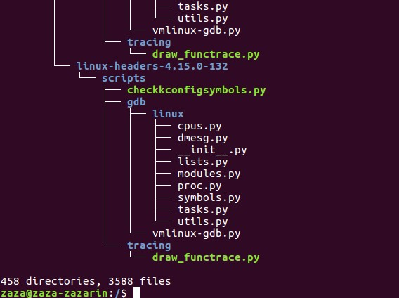</br>

The next command will print us all files named 'c' with all possible formats. `tree -P 'c.*' --prune` (see 5.1.1.12)</br>
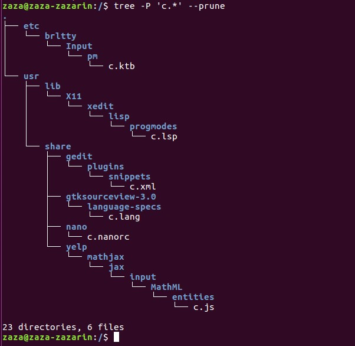</br>

To display all files containing 'c', I entered the next command:
`tree -P '*c*.*' --prune` (see 5.1.1.13)</br>
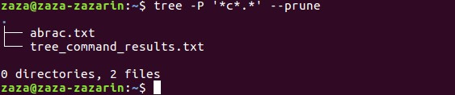</br>

To list all directories and subdirectories up to and including the second level, used the command:
`tree -L 2` (see 5.1.1.14)</br>
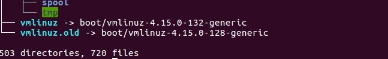</br>

2. The `file` can be used to determine the type of file.</br>
For example, I went to the /bin and
wrote the command `'file *` (see 5.1.1.15)</br>
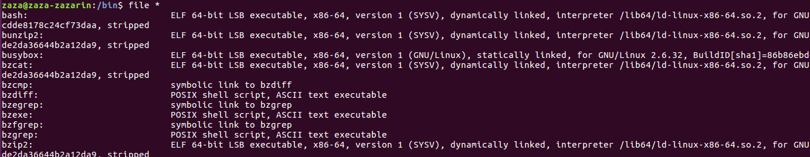</br>
Here we see symbolic links, scripts, binaries.

3. An absolute link contains the full path from the root directory to a file, for example, to go from the home directory to etc by an absolute path we write: `cd /etc` and we find ourselves in the etc directory, wherever we were before.</br>
Relative path is the path from the current directory. For example, the command that will allow us to get from the zaza directory to the zaza_01 directory will look like as follows: `cd ../zaza_01`
If we want to run a file that is in the current directory, we can do this using a relative link. (see 5.1.1.16)</br>
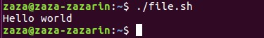</br>
The `cd` command with no arguments will take us to our home directory wherever we are.

4. `ls` has a large number of possible parameters.
For example: `ls -i` will display the index number of each file. (see 5.1.1.17)</br>
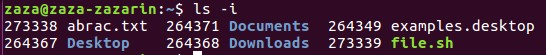</br>

Multiple parameters can be combined if needed. (see 5.1.1.18)</br>
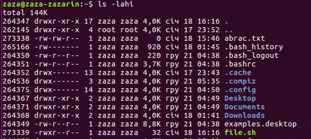</br>

When we use `ls -a` we see all files, even hidden ones.</br>
When we use `ls -l` we see all of our files as a list that contains additional information. Such as permissions, the owner of the file,
weight, time of the last file modification.

5. Created file using redirection. (see 5.1.1.19)

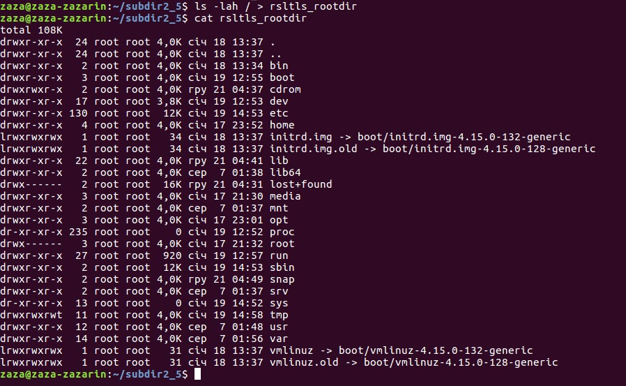</br>


File was copied within absolute and relative addressing.(see 5.1.1.20)

</br>

Deleted subdirectory using following command `rm -r subdir2_5/`</br>
Deleted file with following command `rm rsltls_rootdir`

6. `mkdir test`</br>
`cp ~/.bash_history ~/test/labwork2`</br>
`ln labwork2 hardlink_labwork2`</br>
`ln -s labwork2 symlink_labwork2`</br>
To define type of link we can type `ls -i`

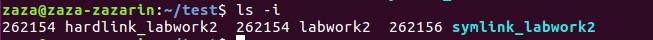</br>
By looking at the inodes number we can define what is what. Also, there many ways to define.</br>
Hard link refers to the same inode. It means that the hard link refers to exact same spot on the hard drive. Hard links may have different names.</br>
Symlink or soft link refers to the name of the file. If we delete this file, the symlink will refer to nowhere and will be useless.

When I changed the data by opening symlic link, data was changed in the original file at the same time. It happened because symlink pointing to
the name hard link.

`mv hardlink_labwork2 hard_lnk_labwork2`</br>
`mv symlink_labwork2 symb_lnk_labwork2`</br>
`rm labwork2`</br>
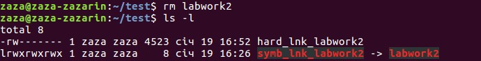</br>

Deleting labwork2 makes symlink useless. Because symlink referred to the name "labwork2" but now it doesn't exist.

7. Using the locate utility, find all files that contain the squid and traceroute sequence.
Before using `locate` we have to make `updatedb` with root pravalages.

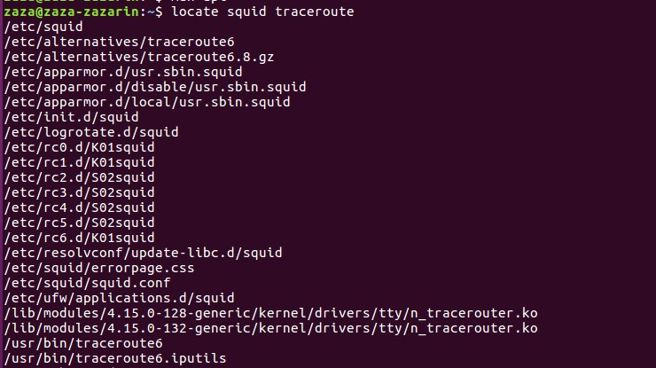</br>

8. The most useful commands for working with hard drives:

- `mount` for a list of all mounted filesystems and mount options for each of them;
- `lsblk` for a tree of block devices, size and mount point (if mounted);
- `df` for a list of mounted block devices, size, used space, available space and mount point.

To determine which partitions are mounted in the system I used
`df`

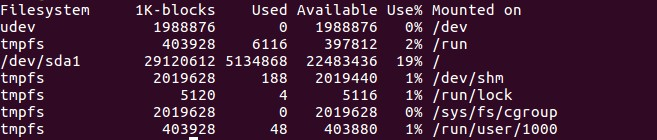</br>
/dev/sda1 - is mounted partition.

9. To complete this task, we will use the output from the /etc/fstab file.
To count the number of lines in this file, we can use the `wc` utility with the `-l` parametr.</br>
</br>

10. The find command does a good job of searching by filename. It has many additional parameters.
We are interested in the `-name` criterion
the command will look like this: `find /etc/ -name "*host*"`

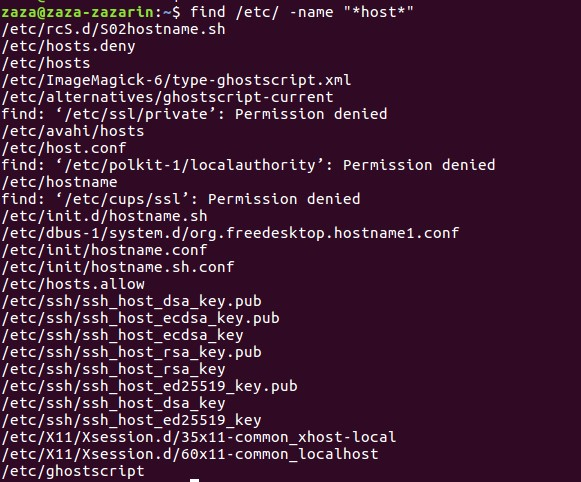</br>

11. We can that by using folowing command: `ls -lah /etc | grep ss`

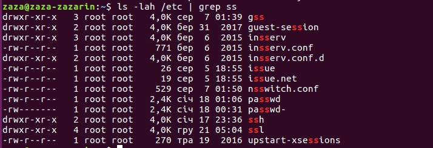</br>

12. To organize a screen-by-screen output of the /etc we have to use redirection.</br> `ls -lah /etc | less`

13. The types of devices are as follows:
- -c Character Device - These devices transfer data
- -b Block Device - These devices transfer data, but in large fixed-sized blocks. Such as harddrives, filesystems
- -p Pipe Device - Named pipes allow two or more processes to communicate with each other, these are
similar to character devices, but instead of having output sent to a device, it's sent to another process.
- -c Socket Device - Socket devices facilitate communication between processes, similar to pipe devices but they can communicate with many processes at once.

To determine the type of device, we can use the command `ls -l /dev`

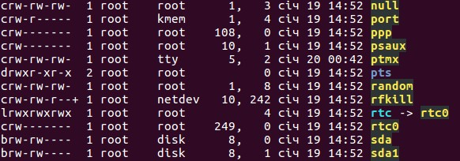</br>

The first bit indicates the type of device(file).
On the screen we can see pseudo device (/dev/null) which is Characret Device.
Hard drives (/dev/sda1) which is block device.

14. We can determine the type of file by using `ls -l`.
The first bit indicates the type of file.</br>
Linux has the following file types:
- "-" - regular file;
- d - directory;
- b - block device;
- c - character device;
- l - symbolic link;
- p - pipe (pipe, fifo);
- s - socket.

15) `ls -lth /etc | grep ^d | head -n 5`

Note: `^d` points the beginning of a line. It's regular expression.</br>
[About regular expression](https://losst.ru/regulyarnye-vyrazheniya-linux)

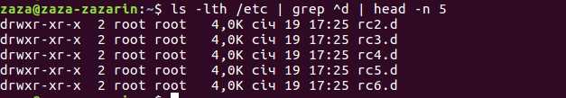</br>
