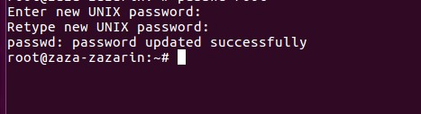
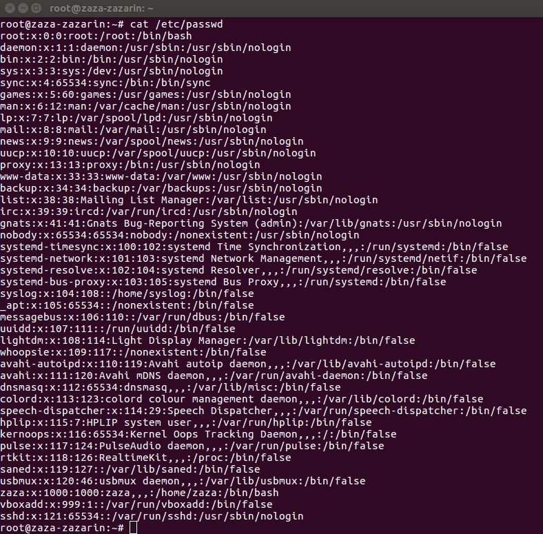
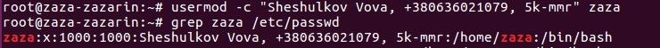
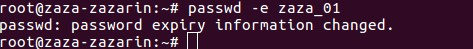
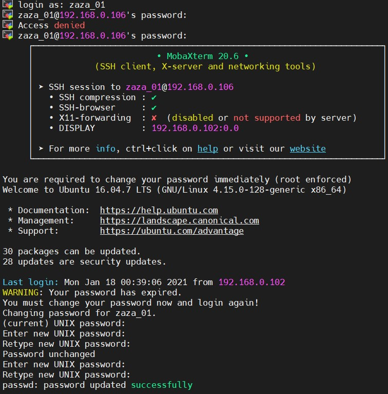
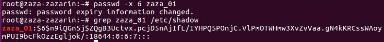
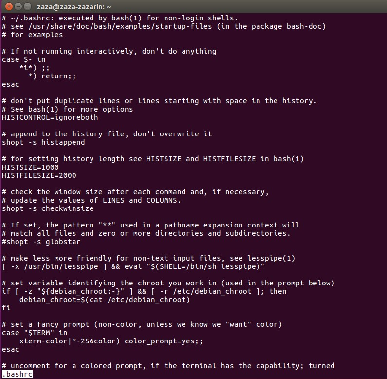
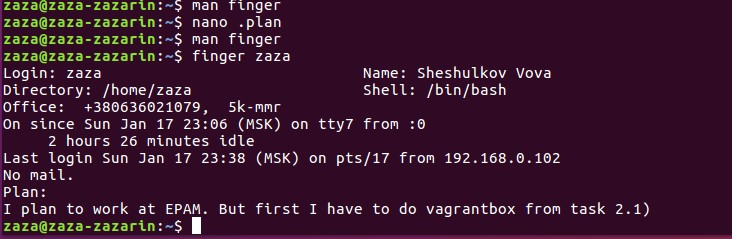
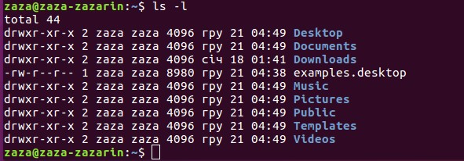

# Linux Essentials
## TASK 5.1
### Part 1

1. Installed Ubuntu 16.04 in VirtualBox. Logged in as root.

2. Changed the password for the root user using the command
`passwd root`</br>(see 5.1.1.1)</br>
</br>
This changed the system file /etc/shadow.

3. (see 5.1.1.2)</br>
</br>
As we can see from the screenshot, the system has pseudo-users. An important distinguishing feature is that they do not have an interpreter. And also their id > 1000.
For example, deamon is used for system services. On my system its uid = 1
There is also a root user. This is the user who owns all the files in current system.
By default, its uid = 0.
uid < 1000 is used for regular users.

4. To add or change user information we will use the `usermod` command
The `usermod` command with the "-c" parameter will allow us to add additional information about the user, such as last name first name,
phone number, rating in computer games.
(see 5.1.1.3)</br>


5. By using `man passwd`, I found 2 interesting keys:</br>

  -e "Immediately expire an account's password. This in effect can force a user
to change his/her password at the user's next login."</br>
(see 5.1.1.4 and 5.1.1.5)</br>
</br>
</br>
 -x Set the maximum number of days a password remains valid. After MAX_DAYS, the password is required to be changed.</br>
(see 5.1.1.6)</br>
</br>
Let's do the same research for the usermod command</br>
 -e, --expiredate EXPIRE_DATE
    The date on which the user account will be disabled. The date is
    specified in the format YYYY-MM-DD.</br>
 -l, --login NEW_LOGIN
    The name of the user will be changed from LOGIN to NEW_LOGIN. Nothing
    else is changed. In particular, the user's home directory or mail spool should probably be renamed manually to reflect the new login name.
    ```
    usermod -l zaza_02 zaza_01
    ```
    Changed the login, but did not change the home directory. The directory must be renamed manually. (see 5.1.1.7)
    

6. More and less are very similar commands, but less is more convenient, there I can scroll the text in the opposite direction,
control with enter and space. To exit the viewer press q
to find something, I entered "/*some_text"</br>
Very helpful commands. Looked at .bashrc content using less command
(see 5.1.1.8)


7. I installed finger. Than opened the manual, looked for information that will help me to complete the task.
Than created the .plan file in the user's home directory and wrote my plan there. (see 5.1.1.9)


8. For this task, the -l parameter will suffice
(see 5.1.1.10)</br>

As we can see  letter "d" indicates that the file is a directory.

### Part 2

I will try to finish before the lecture 18/01/2021.
