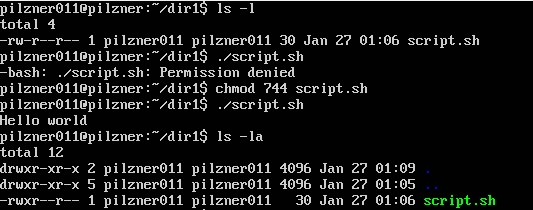

# Linux Essentials
## TASK 5.2

1. In the /etc/passwd we can find username, paswd, user id, group id, uid comments, user's home directory and user's
command interpreter. Its separated by colons.  
In the /etc/group we can find group_name fild, password, group_id and list. The list field contains a comma
separated list of users belonging to this group.

As I know there are three types of users in Linux: root, pseudo-users and regular users.
 
- demon - Used by system service processes
- bin - Gives ownership of executables command
- sshd - used by the secure shell server
To define pseudo-urers we have to know that their id is less than 1000. They have no command interpreter. For secure reasons.

2. Starts from 1000 but not more than 65535.
Uid is a simple numeric designation for an individual user.

To define UID we can use following commands:
`id user_name` or `cat /etc/passwd | grep user_name`
 

3. GID - unique identifier for the group
On the previous screenshot, we can see the GID as well as UID. It's just a second number after UID.

4. We can do this in many ways 
 
 
`groups user_name` 
`login user_name` 
`getent group | grep user_name` 

5. `useradd` is native binary compiled with the system. But, adduser is a perl script which uses useradd binary in back-end. 
`adduser` is more user friendly and interactive than its back-end useradd. There's no difference in features provided. 

For `useradd` there are some parameters that must be specified. 
`-d HOME_DIR` - indicates to the user's home directory(will not be created if it is missing) 
`-e EXPIRE_DATE` - The date on which the user account will be disabled. (YYYY-MM-DD) 
`-f INACTIVE` - The number of days after a password expires until the account is permanently disabled. 
`-g GROUP` - The group name or number of the user's initial login group. The group must exist. 
`-u UID` - The numerical value of the user's ID. 
`-s SHELL` - The name of the user's login shell.

6. By using `usermod -l NEW_LOGIN OLD_LOGIN`

7. The /etc/skel directory contains files and directories that are automatically
copied over to a new user’s when it is created from `useradd` command. This is literally skeleton for new crated users.

 
/etc/default/useradd - is configuration file

8. `userdel -r USER`

9. What commands and keys should be used to lock and unlock a user account?

`passwd -l USER_NAME` - lock the password of the named account. 
`passwd -u USER_NAME` - unlock the password of the named account.
We can do the same with `usermod` 
`usermod -L USER_NAME` 
`usermod -U USER_NAME` 
 
Or we can lock account, not just a password. 
`sudo passwd -e 1 USER_NAME` 
After this command, my test_user was dropped immediately when trying to connect.
`sudo passwd -e -1 USER_NAME` will do this user accessible again.

 

We also can configure nologin to the user.
`sudo usermod -s nologin USER_NAME`

10. We can do this by using `sudo passwd -de USER_NAME`

11. The first column is file characteristic (file type and its permissions). "d" means directory for example, file type following by bits of
permission. "rwx" - readable/writable/executable. First permisions for user, second for group and the last ones for others. Next column tells us
number of links. Owner name. Group name. Number of bytes in the file. Last modification time. File name.

 

12. There are three types of users:
- User(Owner) - the owner of the file;
- Group users - te members of a group of related users;
- Other - everybody else.

 

13. Files have two owners: user (user owner) and the group owner. For each file there is
individual access rights, which are divided into three groups:
- Access for the user who owns the file (owner).
- Access for the group that owns the file (group).
- Access for other users (others).

14. To change the owneer of a file we can use `chown` command.
Here is an example.

 

To change a group who owns the file the following command is requirad: `sudo chown :group file`

For changing mode of access we have to use `chmod`. For example, to add execute rights for user:
`chmod u+x file`

Features of access rights for directories. To see a detailed list of directory subdirectories, we need to add not only
read permissions, but also execute permissions.
The right to read the directory allows us get the names (and only names) of the files in the given directory.
Here is another example of how we can change the access mode.

 

15. What is an example of octal representation of access rights? Describe the umask command.

 
As we see "dir1" has rwxr-xr-x permisions. In octal representation it will equal 755.
r = 4 bits; w = 2 bits; x = 1 bit. So rwx = 7 bits for User. r-x = 5 bits for group and r-x = 5 for others.

`umask` - user file cration mask(file and folder creation mask) 
`umask` - indicates with what default access rights the object will be created (by the principle of subtraction from the maximum rights: 777 for the folder
and 666 for the file)
Default value for umask is 022. It means that when we create the file its permissions will be 666 - 022 = 644 = rw-r--r-- and for the folders
777 - 022 = 755 = rwxrr-xr-x.
We can specify a different value for the umask. And it will affect to the new files and folders for current session.

 

16. The sticky bit limits the ability to delete a file or folder. Most often used for folders. If the sticky bit is set on a folder,
then only the owner or root can delete that folder. Even if the others have all permissions to this folder, they still cannot delete folders and its content.
It is done so that someone does not accidentally delete this folder. 
sticky - content protection bit = 1 or +t (for folders)
So for substitution we have to add this bit. It will looks like `chmod 1757 dir` or `chmod o+t dir`.

 
To find directories with sticky bit I used:
`find / -perm /1000` 
As we can see, directory "crash" and "tmp" have sticky bit enable.

17. Script must be executable.
To make script executable, we should add x attribute.
`chmod u+x file.sh` to make it executable for the owner or we can do that by this way `chmod 744 file.sh`.

 
