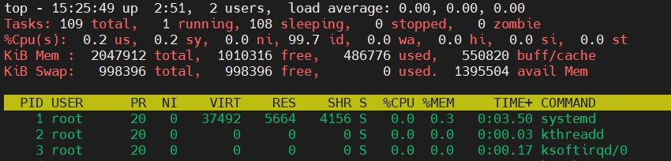

# Linux Essentials
## TASK 5.3
### Part 1

1. How many states could has a process in Linux?

 
As we see on the screenshot, there are five (without zombie) possible states of process:
- Created(NEW) - the process is being created.

- Ready - after the process is created, it is admitted and it comes to the ready state.
In the ready state, the processes are ready to begin execution and it is waiting to be assigned a processor
so that it can begin its execution. Then scheduler dispatches it to the processor.

- Running - when the process begins his execution it is in the running state. After coming to the running state there are three cases that can occur. The first case is it was running and it finished its execution and then it exits and goes to the **Terminated** state. The next case that can occur is there can be an interrupt when the process was being executed.
When it gets interrupted it goes back to the **Ready** state again. The last case that can occur is when it is running it need to wait
for an I/O operation for example(or event wait) when it happens it goes to the **Waiting** state.

- Terminated.

- Waiting - waiting for I/O or event to occur. It may need a signal from somewhere for example. Once I/O or the event
that it was waiting for has been completed it goes to the **Ready** state again.

- Zombie – here, a process is dead, it has been halted but it still has an entry in the process table.

2. Examine the pstree command. Make output (highlight) the chain (ancestors) of the current process.

 
`pstree -h`  
The `-h` key highlights the current process and its ancestors.

`pstree` shows the running processes as a tree. 
Syntax: `pstree [options] [pid or username]` 
`pstree` with `-a` key will show command line arguments for some processes. 
To display PIDs we use `-p` key. 
Also, there is a lot to catch in mind in the man page.

3. What is a proc file system?

The proc filesystem is a pseudo-filesystem where the kernel posts information about currently running or stopped or active processes.
It is mounted at **/proc**. All files have a file size 0 with the exception of kcore. Each of the numbered directories corresponds to an actual process ID.

 

- /proc/PID/cmdline - Command line arguments.
- /proc/PID/cpu - Current and last cpu in which it was executed.
-/proc/PID/cwd - Link to the current working directory.
-/proc/PID/environ - Values of environment variables.
-/proc/PID/exe - Link to the executable of this process.
-/proc/PID/fd - Directory, which contains all file descriptors.
-/proc/PID/maps - Memory maps to executables and library files.
-/proc/PID/mem - Memory held by this process.
-/proc/PID/root - Link to the root directory of this process.
-/proc/PID/stat - Process status.
-/proc/PID/statm - Process memory status information.
-/proc/PID/status - Process status in human readable form.
etc. 

This is where utilities like `top` and `htop` get data about processes.

4. Print information about the processor (its type, supported technologies, etc.).

 

I think `lscpu` will be enough. This is the same as `cat /proc/cpuinfo`

5. Use the ps command to get information about the process.
The information should be as follows: the owner of the process,
the arguments with which the process was launched for execution,
the group owner of this process, etc.

`ps o user,cmd,group,ppid [PID]` 
`o` - Specifies user-defined format.

 
`ps L` lists all format specifiers.

6. How to define kernel processes and user processes?

`ps --ppid=2 --pid=2`

Linux kernel processes are started by the kernel itself, while the parent process allegedly spawned them,
a kthread process is assigned, with PID = 2. Thus, the kernel processes should be considered the process itself with PID = 2,
as well as processes for which the PPID (i.e. the pid of the parent) is 2.

 

Also, by default `pstree` without any parameters shows only the tree of processes started by init. Which are user processes.
`pstree 2` will show us kernel processes.

 

7. Print the list of processes to the terminal. Briefly describe the statuses of the processes. What condition are they in, or can they be arriving in?

 

PID=1711 in **S** status which means interruptible sleep. 
PID=1817 in **R** which means that process running or on run queue.

"+" means that process is in the fg process group.

Notes from man page:

- D    uninterruptible sleep (usually IO)
- R    running or runnable (on run queue)
- S    interruptible sleep (waiting for an event to complete)
- T    stopped by job control signal
- t    stopped by debugger during the tracing
- W    paging (not valid since the 2.6.xx kernel)
- X    dead (should never be seen)
- Z    defunct ("zombie") process, terminated but not reaped by its parent

For BSD formats and when the stat keyword is used, additional characters may be displayed:

- "<"  high-priority (not nice to other users)
- N    low-priority (nice to other users)
- L    has pages locked into memory (for real-time and custom IO)
- s    is a session leader
- l    is multi-threaded (using CLONE_THREAD, like NPTL pthreads do)
- "+"  is in the foreground process group

8. Display only the processes of a specific user.

`ps u -u [user]`

I've included `u` to get the extended format.

 

9. What utilities can be used to analyze existing running tasks (by analyzing the help for the `ps` command)?

I found the following utilities:

- `pgrep` - looks through the currently running processes and lists the process IDs which match the selection criteria to stdout.
- `pstree`
- `top` - display Linux processes

10. What information does `top` command display?

The `top` program provides a dynamic real-time view of a running system.

12. What interactive commands can be used to control the top command? Give a couple of examples.

I think `h` is the place where we shoud start. Displays help. 
To display only process those using CPU use `i` command. 
We can add or remove specific fields by using `F` 

 

We are also able to set the sort field. And even move those fields.

We can customize colors by using `Z`. To able or disable color mode use `z`

 

`W` command will save the changes. The changes will be saved in ~/.toprc 
`u` will filter by user or uid 
`o` is more powerful. With `o` we can make specific filters. 
For example. If I wanna find a process which started with the command `sleep`: 
`o` than `COMMAND=sleep` 
I can add another filter in case that I have to specify the user by type another `o`. 
For resetting the filter use `=`

To kill process `k` then enter the PID. Then we have to enter a signal for the process. The default signal is **SIGTERM**.

 

13. Sort the contents of the processes window using various parameters (for example, the amount of processor time taken up, etc.)

`F` > s on the TIME+ field. 
 

14. Concept of priority, what commands are used to set priority?

Linux systems use a priority system with 40 priorities, ranging from NI=-20 same as PR=0 (highest priority) to NI=19 same as PR=39 (lowest priority).
Processes started by regular users usually have priority 0. To find out which priority is we have to type `nice` without arguments.
The higher the `nice` value(NI), the lower the priority. And vice versa.
Regular users can usually only make their processes nicer. We have to be a root to specify negative priority adjustments.
`nice` - sets priority;
`renice` - changes priority.

15. Can I change the priority of a process using the top command? If so, how?

Yes, You can :) 
`r` > Enter the PID > Enter the value.

 

 

16. Examine the kill command. How to send with the `kill` command
process control signal? Give an example of commonly used signals.

`kill` - send a signal to a process; `kill [options] <pid> [...]` 
The  default signal for kill is TERM. 
`kill -l` - will show up a list of signals and their corresponding numbers.

Some experiments and also examples of using signals
 

Useful information about signals:
- SIGKILL(9) - murders a process ruthlessly without asking that process to stop(without any input from the process). This one
is better when process not responding.
- SIGTERM(15) - kill a process with asking that process about it.

17. Commands jobs, fg, bg, nohup. What are they for? Use the sleep, yes command to demonstrate the process control mechanism with fg, bg.

`jobs` displays the status of jobs that started from the current terminal 
`fg` and `bg` used for background process management as well as `jobs` by the way. 
`fg` command in linux used to put a background job in foreground 
`bg` command in linux is used to place foreground jobs in background 
 

`nohup` is a command that ignores the HUP signal. It is a signal that is delivered to a process when its associated shell is terminated.
In other words `nohup` allows the process to stay running even after log out. 
Syntax: `nohup command arguments` 
It is worth mentioning that processes started with `nohup` command will redirect all stdout and stderr to a file named "nohup.out".
Let's try :)
 

### Part 2

1. Check the implementability of the most frequently used OPENSSH commands in the MS Windows operating system.
(Description of the expected result of the commands + screenshots: command – result should be presented)

First of all `ssh name@address` it works exectly the same way as from linux 

 

`ssh-keygen` also works the same way 
 

The problems occurred when I was trying to copy my public key to the remote machine. This command doesn't exist on Windows.

 

Yes, we can do this manually, but what the heck automation is it? :)
So the way that I did it is not perfect because if I type the following command again, it will overwrite the existing authorized_keys, but it works for now.

`scp .\id_rsa.pub pilzner011@192.168.0.104:./.ssh/authorized_keys`

 

2. Implement basic SSH settings to increase the security of the client-server connection.

To increase the security we can:
Change the default ssh port (verify that port in not blocked; avoid the most common var 222, 2222, 22222; 
`sudo nano /etc/ssh/sshd_config` 
 

Disable password authentication

`sudo nano sshd_config` 
uncomment **PasswordAuthentication** string and set "yes" near this.
The result of trying to connect as following 
 

3. List the options for choosing keys for encryption in SSH. Implement 3 of them.

To make different type of key `ssh-keygen -t [key-type]`

- rsa - default key
- ed25519
- dsa

4. Implement port forwarding for the SSH client from the host machine to the guest Linux virtual machine behind NAT.

If I understood the task correctly the following screenshots will show this up. 

 

 

5*. Intercept (capture) traffic (tcpdump, wireshark) while authorizing the remote client on the server using ssh, telnet, rlogin. Analyze the result.

To capture traffic I used tcpdump utilities on the server.

`sudo tcpdump -ni enp0s3 -w dump.pcapng host 192.168.0.102`

For further analysis using Wireshark, I sent dump file to my desktop machine by using `scp`

 

We see how tcp protocol works. To make the connection more stable the three-ways handshake was used.
TTL ~128 means that the segment was sent from Windows machine and TTL ~64 means it was Unix like system.
I.e. client is Windows and the server with a higher chance is Linux. 
Then Elliptic curve Diffie-Hellman protocol was used to make the shared key. 
The connection was reset on the client-side, this can be seen by the set flag -Reset.

 
