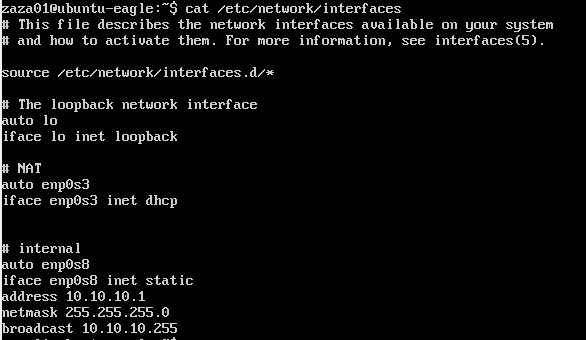

# Networking with Linux
## TASK 6.1

To complete the task I used Ubuntu16.04srv with "Internal network interfaces".

I configured static ip by editing /etc/network/interfaces

 

Let's bring our iface up with `ip link set enp0s3 up`

 

Next, we move on to the second workstation. We configure two network adapters for it. The first adapter will be in NAT mode, this interface will receive IP via DHCP.
The second adapter is an internal, which will also need to be configured manually. This interface will be the default gateway for the machine behind the internal network.

 

We forward the port to our workstation behind Nat. So that in the future we can go to it remotely.

 

Implementing an ssh connection to the above machine.

 

Next, let's move on to iptables.

On my Ubuntu16.04srv `iptables` was pre-installed.

For a VM behind NAT, we need to enable ipv4 forwarding in the
/etc/sysctl.conf 
``sudo nano /etc/sysctl.conf``

 

Now we configure iptables so that packets that come from the machine behind the internal network can be forwarded through the machine behind NAT.

 

`sudo iptables -t nat -A POSTROUTING -o enp0s3 -j MASQUERADE` 
`sudo iptables -A FORWARD -i enp0s8 -o enp0s3 -m state --state RELATED,ESTABLISHED -j ACCEPT` 
`sudo iptables -A FORWARD -i enp0s8 -o enp0s3 -j ACCEPT` 

`sudo iptables -S` will show us what chains are in our iptables.

Further, in order not to create rules every time when we start the system, we will save the iptables settings.

Create directory `sudo mkdir / etc / iptables-conf`

`sudo iptables-save > /etc/iptables-conf/iptables_rules2.ipv4`

Next, we reboot the system and restore the iptables settings using the following command: 
`sudo iptables-restore /etc/iptables-conf/iptables_rules2.ipv4`

 

Then ping 8.8.8.8 from the machine to the internal network.

 

 

 

 

Almost everything worked as was expected.
