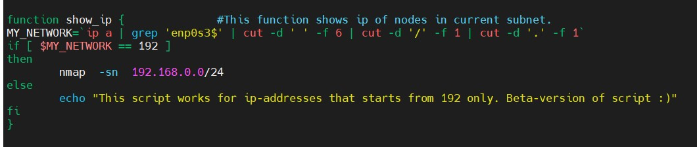

# Linux administration with bash.
## TASK 7.1

### Part A

I think it is not how it must be done. But the functionality works fine. 
Inside:
 
Outside:
 

After I slept with the thought of the existence of such script and eventually I decided to make my script slightly more resilient but it's still not so good as I want.

 

I have to go on for now without solving "B" and "C"

### Part B

### Part C
