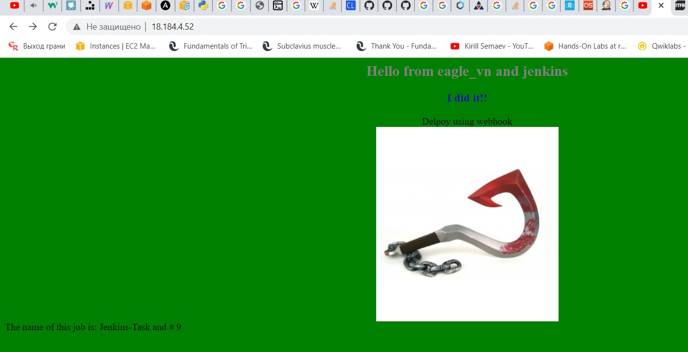

# Continues integration/Continues Delivery and Deployment  
## TASK 8.1

To complete the task I wanna use Jenkins as automation server.
The whole idea is simple. One Developer will commit something in GitHub repository, then using Webhook GitHub notify Jenkins-Master that in the master branch was push from developers. After that Jenkins will check if something new was appear? If that, Jenkins pull this differences and push it to the Node-1. Node-1 will build and test the code and then deploy it to the PROD-Server. Simple is that.

Then I will go step by step. (pre-configuration)
- Create instance for Jenkins-Master using AWS
  - Install OpenJDK-8
  - Install Jenkins using documentation
  - Install recommended plugins + Green Balls
- Create instance for Node-1
  - Install OpenJDK-8
  - Add Credentials. Chose "SSH Username with private key". Specify ID(ssh-key-jenkins), Description, Username(ubuntu), enter the private content of private key.
  - Add new Agent to Jenkins-Master. Configure Remote root directory(/home/ubuntu), labels(ubuntu18 ubuntu_java8), Usage(As mush as posible)
  Launch method will be - Launch agents via SSH. Specify host(IP). Chose Credentials from last step. To avoid adding finger prints we chose "Manually trusted key Verification Strategy".
- Create instance with WebServer Apache.
  - Install Apache2
  - Change owner of /var/www/html
  - Add its private key to the Jenkins-Master under the "Publish over SSH"
  - Add this Server. Fill up the name, Hostname, Remote Directory(/var/www/html)
- Create instance for Developer and GitHub Repository.
  - Generate key-pair
  - Upload the key from the developer's workstation to the Repository
  - Clone the repository, crate index.html and then push it (for test connection)
- Create credential for login via SSH to my repository.
- Create Job "Jenkins-Task"
  - Chose "GitHub project" and put there my repo URL
  - Source Code Management - Git. Chose credentials from last step.
  - Check the box called "GitHub hook trigger for GITScm polling"
  - Also check the box "Restrict where this project can be run" - ubuntu18
  - Discard old builds. Not more than 15.
  - Add Build > Execute shell > Display JobName and its ID.
  - Add Build > Execute shell > Simple test.
  - Post build actions > Send Build Artifact over SSH. > Specify my WebServer. With exec command "sudo systemctl restart apache2"

Check if its even work or not. Wish me luck :) 
 
Fine.

Now let's configure webhook on the GitHub repository.

 

Try to push something and ...

 

Add some fun.

 
